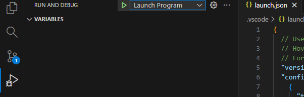
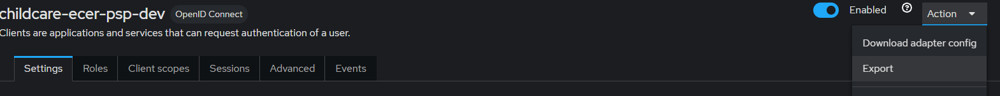

# Github action script to populate keycloak configuration

## How to use

- Github secrets required

| Secret           | Usecase                                   | Format |
| ---------------- | ----------------------------------------- | ------ |
| KC_ENVIRONMENT   | Keycloak environment name                 | string |
| KC_REALM_ID      | Keycloak realm identifier                 | string |
| KC_CLIENT_ID     | Client ID for general Keycloak access     | string |
| KC_CLIENT_SECRET | Client secret for general Keycloak access | string |

## Tips

### Openshift commands

- If you want to execute openshift CLI commands you can do so by adding this to the github-action script

```
- name: Install oc
        uses: redhat-actions/openshift-tools-installer@v1
        with:
          oc: 4
```

You can then add in the "exec" variable in the script.js portion to access it in script.js

```
import { exec } from "node:child_process";
```

Then use it in script.js like so

```
exec("oc", (error, stdout, stderr) => {
    if (error) {
      console.error(`exec error: ${error}`);
      return;
    }
    console.log(`stdout: ${stdout}`);
    console.error(`stderr: ${stderr}`);
  });
```

Source: https://nodejs.org/api/child_process.html#child_processexeccommand-options-callback

### Local Debugging

- local debugging in Visual Studio Code

We can do this with a launch.json file to run the script and load the required environment variables to the scripts

```json
  // Use IntelliSense to learn about possible attributes.
  // Hover to view descriptions of existing attributes.
  // For more information, visit: https://go.microsoft.com/fwlink/?linkid=830387
  "version": "0.2.0",
  "configurations": [
    {
      "type": "node",
      "request": "launch",
      "name": "Launch Program",
      "skipFiles": ["<node_internals>/**"],
      "program": "${workspaceFolder}\\tools\\iac\\script.js",
      "envFile": "${workspaceFolder}/tools/iac/.envrc"
    },
  ]

```

modify the program and envFile to where your files are.

You will need to create an .envrc file in the respective folder that looks like this no "" required. Ex. export KC_ENVIRONMENT=myInput

```
export KC_ENVIRONMENT=<<STRING>>
export KC_REALM_ID=<<STRING>>
export KC_CLIENT_ID=<<STRING>>
export KC_CLIENT_SECRET=<<STRING>>
export KC_BASIC_BCEID_CLIENT_ID=<<STRING>>
export KC_BASIC_BCEID_SECRET=<<STRING>>
export KC_BCSC_CLIENT_ID=<<STRING>>
export KC_BCSC_SECRET=<<STRING>>
```


Click the play with bug icon and launch the script with the green play button. You will be able to set breakpoints in your code and change environment variables.


To easily add additional clients, you can create the template first in keycloak and then export it directly to the mappers array
